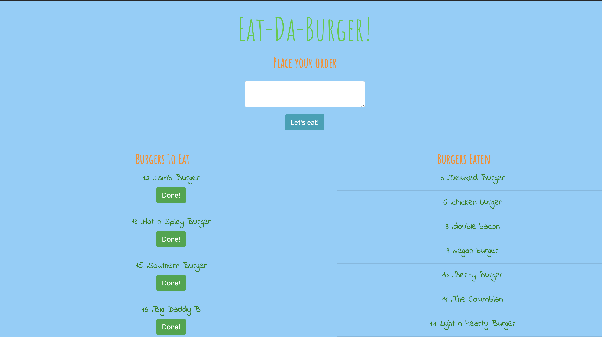
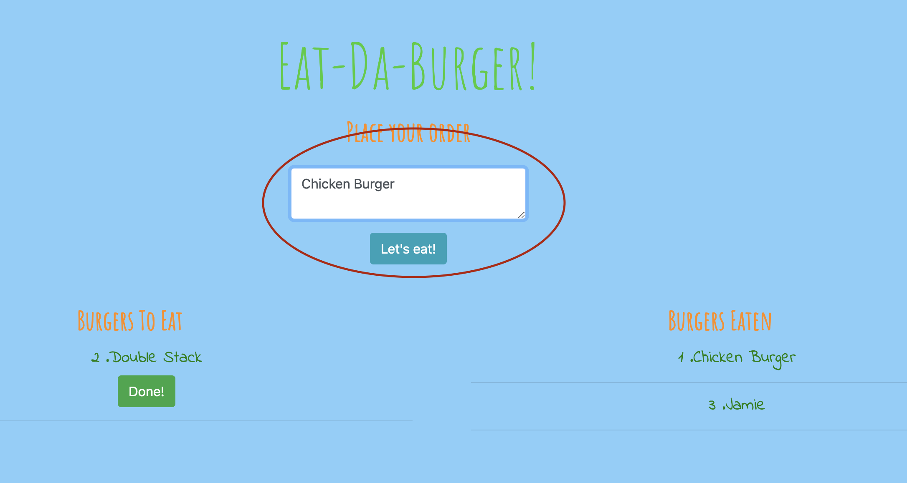
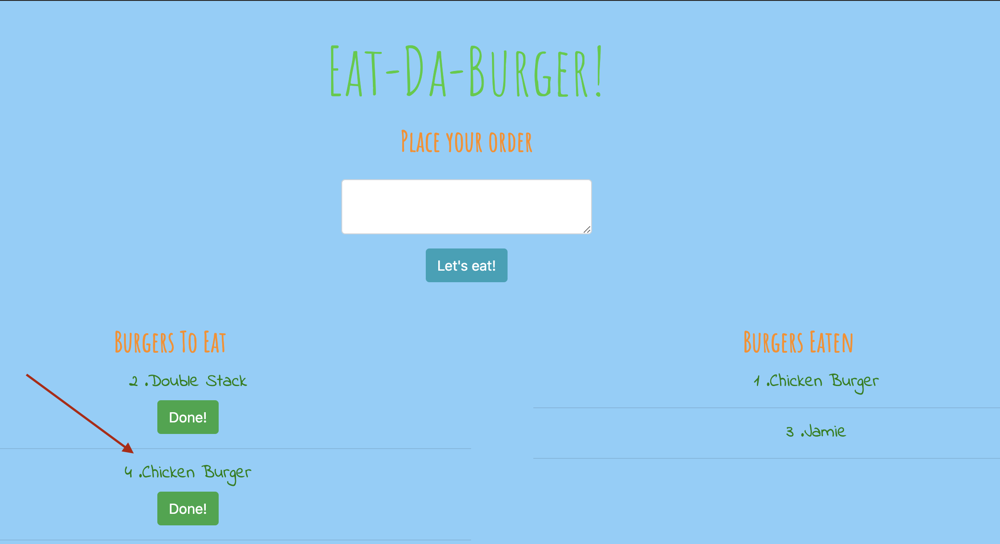
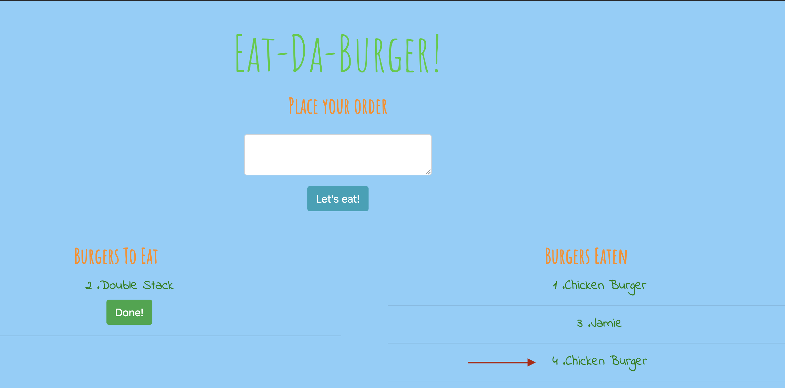

# EAT- DA- BURGER!

## Description 
Eat-Da-Burger! is a restaurant app that lets users input the names of burgers they'd like to eat.

Whenever a user submits a burger's name, your app will display the burger on the left side of the page -- waiting to be devoured.

Each burger in the waiting area also has a Devour it! button. When the user clicks it, the burger will move to the right side of the page.

The app will store every burger in a database, whether devoured or not.

## Technologies Used 
MySQL, Node.js, Express, Handlebars, and customized ORM.
This app follows the MVC design pattern; use Node and MySQL to query and route data in your app, and Handlebars to generate your HTML.

## How It Works 
This is how the page look when it first load. 

User input the name of the burger that they want in the white box and click "Let's eat" button. 

The burger will appear on the left column title "Burger To Eat".

Once the user click the "Done!" button, the burger will transfer to the right column title "Burger Eaten". 

## Deployment 
 https://vast-ridge-83982.herokuapp.com/